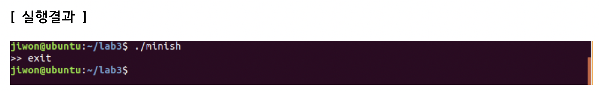
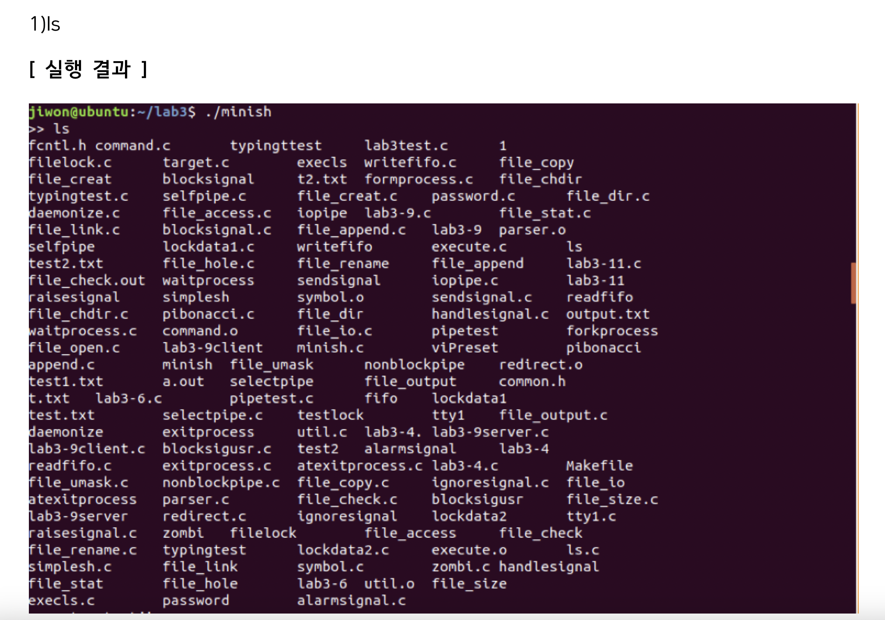
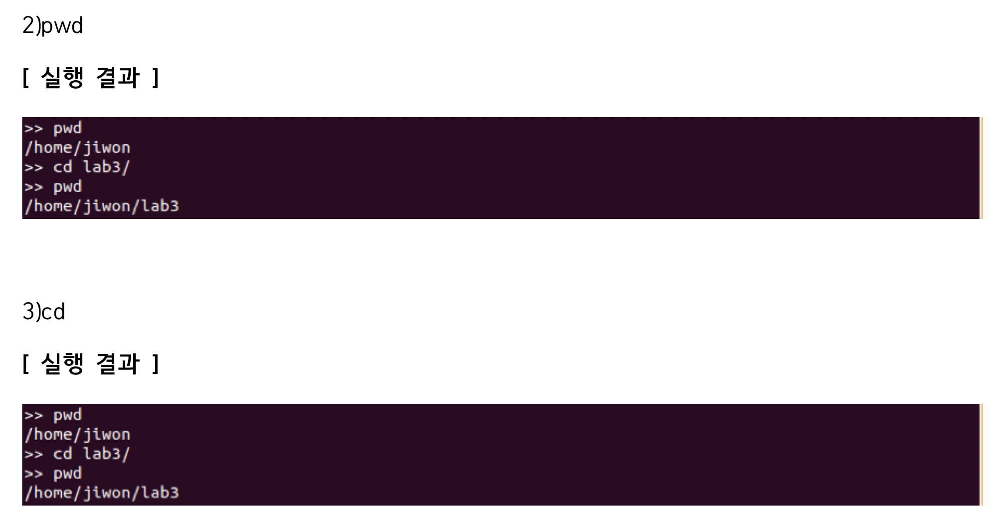
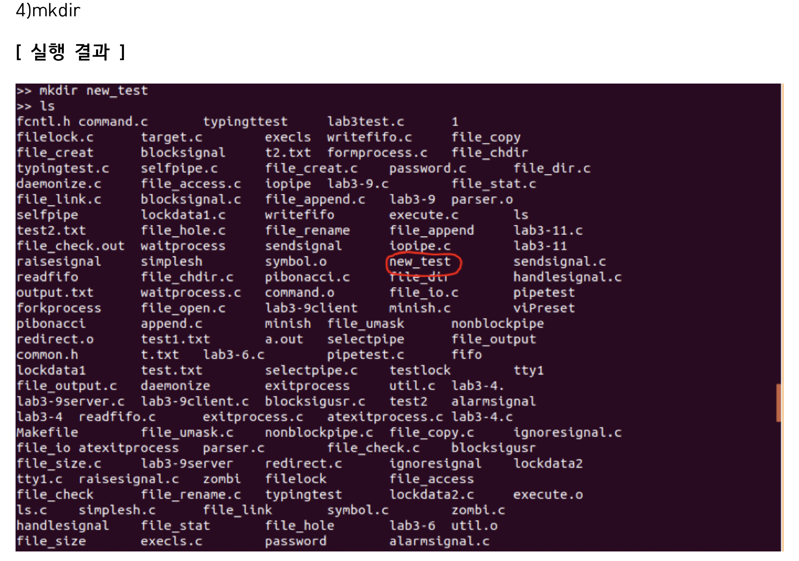
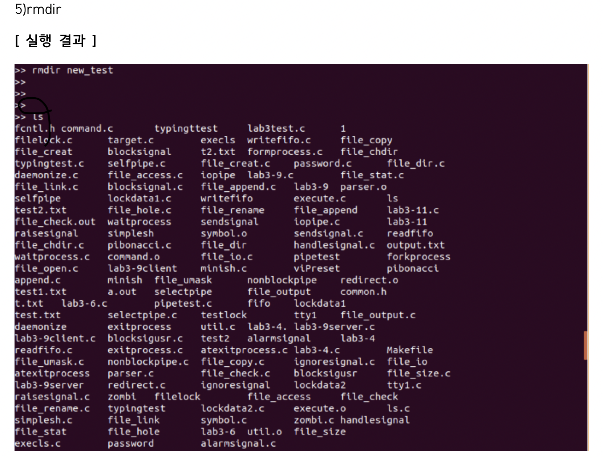
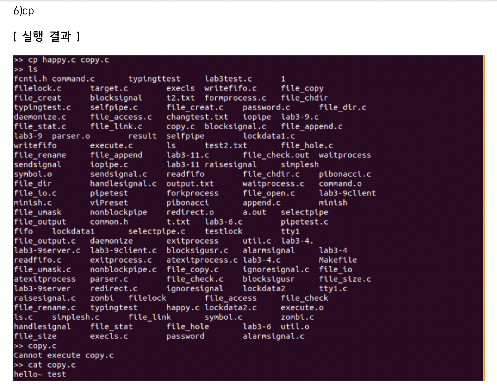

# 🔧 나만의 간단한 쉘 프로그램 (Simple Shell Implementation)

## 📝 프로젝트 개요
운영체제(OS)의 커널과 사용자 사이를 연결하는 인터페이스인 Shell의 핵심 동작 원리를 이해하고, 리눅스 시스템 콜(System Call)을 활용해 직접 명령어를 해석하고 실행하는 나만의 콘솔 기반 쉘 프로그램을 C언어로 개발했습니다.
## 📅 프로젝트 기간
* 2018.11.12 ~ 2018.11.22

## 💻 기술 스택
* **Language**: C
* **Operating System**: Linux (Ubuntu 16.04 LTS / VMware 환경)
* **Development Tools**: GNU Toolchain (gcc, make, gdb), Bash shell

## 🎯 프로젝트 목적 및 내용

### 1. POSIX 시스템 콜 기반 프로세스 제어 시스템 구축
리눅스 커널 인터페이스를 활용하여 사용자가 입력한 명령어를 토큰 단위로 파싱하고, 멀티 프로세스 환경을 동적으로 제어하는 코어를 구현했습니다.
* **프로세스 분기 및 실행**: `fork()` 시스템 콜을 통해 자식 프로세스를 생성하고, `execvp()` 계열 함수를 연동하여 독립적인 명령어 바이너리가 쉘 내부에서 실행되도록 아키텍처를 설계했습니다.
* **백그라운드 실행**: 백그라운드 연산 기호(`&`, `S_AMP`) 식별 로직을 구현하여 부모 프로세스의 대기(`wait`) 분기를 최적화했습니다.

### 2. 쉘 내장 명령어 및 예외 처리 시스템 구현
운영체제 이용에 필수적인 기본 파일 제어 명령어(`ls`, `pwd`, `cd`, `mkdir`, `rmdir`, `cp`)의 명세 흐름을 구현하고 예외 상황에 따른 안전한 종료(`exit`) 시퀀스를 설계했습니다.
* **인자 파싱 및 동적 메모리 할당**: 가변 인자 처리 시 오버플로우를 방지하기 위해 최대 인자 개수(`MAXARG`)를 제한하고, 각 토큰 배열(`argv`)의 메모리를 실시간 할당(`malloc`) 및 복사(`strcpy`)하도록 정밀 설계했습니다.

```C
/* 명령어 토큰화 및 아규먼트 벡터(argv) 동적 메모리 적재 */
case S_WORD:               
    if(argc == MAXARG) {
        fprintf(stderr, "Too many args.\n");
        break;
    }
    argv[argc] = (char *) malloc(strlen(word) + 1);
    if (argv[argc] != NULL) {
        strcpy(argv[argc], word);
        argc++;
    }
    continue;
```

### 3. 파일 시스템 스트림 및 입출력 재지향(Redirection) 핸들링
표준 입력/출력 스트림의 파일 디스크립터(File Descriptor)를 조작하여 프로그램 실행 결과를 파일로 저장하거나 읽어오는 인프라를 안정화했습니다.

* **스트림 예외 감지**: 소스 파일 열기 및 타깃 파일 생성 시 커널 반환 상태를 체크하여, 자원 유실이나 크래시 없이 표준 에러 스트림(`stderr`)에 로깅 후 세션을 안전하게 반환(`exit(0)`)하도록 예외 분리를 철저히 했습니다.

```C
/* I/O Redirection 및 파일 접근 예외 상황 처리 분기 */
else if (open(sourcefile, O_RDONLY, 0) == ERROR)
{
    fprintf(stderr, "Cannot open %s\n", sourcefile);
    exit(0);  // 프로세스 비정상 종료 예외 전파 차단
}

if (open(destfile, flags, 0666) == ERROR) 
{
    fprintf(stderr, "Cannot create %s\n", destfile);
    exit(0);  // 자원 생성 실패 시 안전 시퀀스 실행
}
```

## 🛠️ 주요 기능 및 코드 구조

### 1. 명령어 파싱 및 실행 인터페이스 (`Command Core`)
#### `main.c` 
* 무한 루프 프로프트를 통한 사용자 입력 대기 및 문자열 스캔
* 시그널(Signal) 핸들링 처리를 통한 내부 인터럽트 방어 환경 구축
* 파싱된 토큰 구조체를 `execute()` 모듈로 전달하는 데이터 파이프라인 관리

#### `execute.c`
* 내장 명령어(`cd` 등 부모 프로세스가 직접 수행해야 하는 명령)와 외장 명령어 분기
* `fork()` 기반의 다중 자식 프로세스 생명 주기 관리 및 자원 반환 제어

### 2. 파일 및 디렉토리 제어 모듈 (`File Operations`)
#### `commands.c`
* `sys`/`stat.h` 및 `unistd.h` 표준 헤더 기반 커널 함수 바인딩
* `mkdir`, `rmdir` 등 파일 시스템 변경 요청에 대한 디렉토리 버퍼 핸들링

## 🖥️ 실행 결과

### exit 기능 검증


`exit` 명령 입력 시, 할당된 쉘 메모리를 안정적으로 해제하고 프로세스가 부모 쉘 환경으로 안전하게 복귀하는 흐름을 검증했습니다.

### ls 디렉토리 리스팅 화면


자식 프로세스 분기를 통해 현재 작업 디렉토리 내부의 파일 목록 및 노드 리스트를 정상적으로 스캔 및 렌더링하는 화면입니다.

### pwd 및 cd 주소 이동 기능


환경 변수 및 현재 작업 디렉토리 경로를 실시간 변경하고 pwd 명령어로 변경된 위치가 고정 트래킹됨을 보장합니다.

### mkdir / rmdir 파일 생성 및 제거 테스트



시스템 가상 노드에 접근하여 사용자 입력 인자명으로 디렉토리를 동적 생성하고 권한 및 구조를 확인합니다.

### cp 파일 복사 및 데이터 스트림 검증


지정 파일 스트림을 버퍼 단위로 읽어 들여 타깃 파일에 정상적으로 쓰기 작업이 완수 및 동기화됨을 관찰했습니다.

## ⚠️ 프로젝트 문제점 및 한계
1. 익명 파이프(`pipe()`) 시스템 콜을 사용해 다중 명령어의 표준 출력을 다음 명령어의 표준 입력으로 리다이렉션하는 체인을 설계하는 과정에서 복잡한 파일 디스크립터 복사(`dup2`) 흐름으로 인해 동기화 이슈가 발생했습니다.

2. 프로세스 분기 후 자식 프로세스의 종료 상태를 부모 프로세스가 정상적으로 회수하지 못할 경우 발생할 수 있는 '좀비 프로세스(Zombie Process)' 현상 제어에 구조적인 한계가 있었습니다.

3. 고정된 `MAXARG` 범위 이상의 예외적 입력 스트림 유입 시 동적 배열 인덱스 초과 가능성에 대한 사전 메모리 방어 설계가 완벽히 고도화되지 못했습니다.

## ✅ 수정 및 보완 사항
* **트랜잭션 및 예외 시퀀스 강화:** 입출력 파일 제어 실패 시 `exit(0)` 분기 처리를 정밀화하여 예외 데이터 유입으로 인한 메인 쉘 크래시 현상을 완벽히 방어했습니다.

* **인자 파싱 로직 안정화:** 가변 길이 단어(`S_WORD`) 탐지 시 `strlen()+1` 만큼 정확히 동적 바인딩하여 댕글링 포인터 및 메모리 누수 취약점을 사전 보완했습니다.

* **향후 과제:** 프로세스 종료 시그널인 `SIGCHLD` 핸들러 등록을 통해 비정상 좀비 프로세스를 자동으로 커널에 반환하는 비동기 프로세스 소멸 로직을 추가 반영할 예정입니다.
